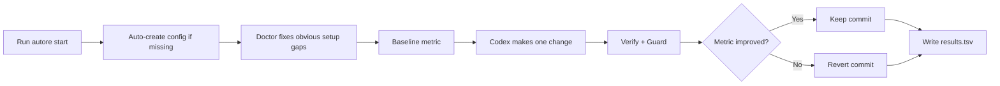

# Codex Autoresearch

[](https://github.com/wimi321/codex-autoresearch/actions/workflows/ci.yml)
[](LICENSE)
[](https://github.com/wimi321/codex-autoresearch)

English | [简体中文](docs/README.zh-CN.md)

Codex Autoresearch is the easiest way to turn the Karpathy autoresearch loop into a real Codex workflow on your own repo.

Instead of giving you a pile of prompts, it gives you a runner:

- one goal
- one measurable metric
- one Codex change at a time
- one verify step after every change
- one keep-or-revert decision logged to disk

## Start Here

If you want proof in under a minute:

```bash
autore start --demo --run
```

If you want to use it on your own repo:

```bash
autore start
```

If you want a visual control room instead of memorizing commands:

```bash
autore ui --open-browser
```

If you want the tool to prepare the repo and tell you exactly what to do next:

```bash
autore onboard --write-nightly
```

## What Happens When I Run `autore start`?

`autore start` is the default happy path.

It will:

1. detect whether your repo looks like Python, Node, or generic
2. create `autoresearch.toml` if it does not exist yet
3. run `autore doctor --fix`
4. establish a baseline metric
5. run a bounded Codex loop
6. keep improvements and revert non-improvements

During long runs, logs are written to `.autoresearch/runs/iteration-XXXX/`.

## What Problem Does This Solve?

This project is for the moment when you want Codex to improve a repository mechanically instead of vaguely.

Examples:

- increase pytest coverage
- reduce bundle size
- expand collected tests
- improve a build output metric
- keep trying small changes until a measurable number gets better

## Commands Most People Actually Need

### 1. Fastest proof

```bash
autore start --demo --run
```

### 2. First run on a real repo

```bash
autore start
```

### 3. Prepare the repo and get a next-step checklist

```bash
autore onboard
```

### 4. Open the local UI

```bash
autore ui --open-browser
```

### 5. Create a nightly GitHub Actions workflow

```bash
autore nightly --force
```

### 6. Watch a long run

```bash
autore watch --follow
autore watch --stream stdout --follow
autore watch --stream results
```

### 7. Resume where you left off

```bash
autore start --resume
autore run --resume --iterations 5
```

## Typical First-Time Flow



## The New Easiest Path: `autore onboard`

If you do not want to think about setup details, use:

```bash
autore onboard --write-nightly
```

It will:

- run doctor with auto-fix enabled
- make sure `.autoresearch/` is ignored
- infer a sensible preset
- explain the best use case for this repo
- print the exact next commands to copy
- optionally generate `.github/workflows/autoresearch-nightly.yml`

## Visual UI

If you prefer clicking over remembering commands, run:

```bash
autore ui --open-browser
```

The local UI gives you:

- a repo health dashboard
- one-click setup repair
- one-click onboarding and nightly workflow generation
- a live task queue with streaming terminal output
- a built-in config editor with save button
- a metric chart and run timeline
- recent results without opening TSV files by hand

## Example Configs

### Python repo

```toml
[research]
goal = "Increase test coverage from 72 to 90"
metric = "coverage percent"
direction = "higher"
verify = "pytest --cov=src 2>&1 | grep TOTAL"
scope = ["src/**", "tests/**"]
guard = "pytest"
iterations = 10
```

### Node repo

```toml
[research]
goal = "Reduce bundle size below 200 KB without breaking tests"
metric = "bundle size kb"
direction = "lower"
verify = "npm run build 2>&1 | grep 'First Load JS'"
scope = ["src/**"]
guard = "npm test"
iterations = 10
```

## Nightly Runs Without Writing YAML by Hand

Generate the workflow:

```bash
autore nightly --force
```

Or let onboarding do it for you:

```bash
autore onboard --write-nightly
```

The generated GitHub Actions workflow:

- runs every day at `01:00 UTC`
- prepares the repo with `autore doctor --fix`
- runs a bounded resume loop
- uploads `.autoresearch/results.tsv` and run logs as artifacts

See [docs/nightly.md](docs/nightly.md) and [examples/nightly.yml](examples/nightly.yml).

## What You Get Back

- `autoresearch.toml`: repo-specific loop config
- `.autoresearch/results.tsv`: iteration-by-iteration ledger
- `.autoresearch/runs/...`: stdout/stderr logs for each Codex run
- automatic keep/discard behavior based on your metric
- optional guard command to block regressions

## Why This Feels Simpler Than Other Autoresearch Projects

Most autoresearch repos stop at prompts.

This one gives you a runnable outer loop for Codex:

- `autore start` for the shortest happy path
- `autore onboard` for first-time repo setup
- `autore nightly` for scheduled GitHub runs
- `autore watch` for long-task visibility
- `autore run --resume` for continuing an existing branch

## Files You May Want

- [src/codex_autoresearch/cli.py](src/codex_autoresearch/cli.py)
- [src/codex_autoresearch/runner.py](src/codex_autoresearch/runner.py)
- [docs/nightly.md](docs/nightly.md)
- [docs/architecture.md](docs/architecture.md)
- [docs/faq.md](docs/faq.md)
- [examples/demo-repo/README.md](examples/demo-repo/README.md)
- [examples/nightly.yml](examples/nightly.yml)
- [CHANGELOG.md](CHANGELOG.md)

## Inspiration

- [karpathy/autoresearch](https://github.com/karpathy/autoresearch)
- [uditgoenka/autoresearch](https://github.com/uditgoenka/autoresearch)
- [openai/codex](https://github.com/openai/codex)
