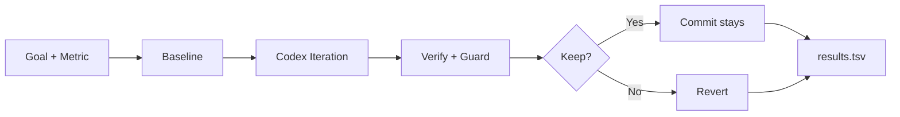

# Codex Autoresearch

[](https://github.com/wimi321/codex-autoresearch/actions/workflows/ci.yml)
[](LICENSE)
[](https://github.com/wimi321/codex-autoresearch)

English | [简体中文](docs/README.zh-CN.md)

Codex Autoresearch is a Codex-native implementation of the Karpathy loop: one metric, one focused change, one verification step, repeated until the repository gets better.

It takes the core ideas from [karpathy/autoresearch](https://github.com/karpathy/autoresearch) and the product framing from [uditgoenka/autoresearch](https://github.com/uditgoenka/autoresearch), then rebuilds them for OpenAI Codex as a real executable runner.

## At a Glance

- One command setup: `autore start`
- Real runner, not just prompts
- Works with `codex exec`
- Supports `watch`, `resume`, and bounded loops
- English + Simplified Chinese docs
- Copyable [demo repo](examples/demo-repo/README.md)

## Flow



## One command setup

```bash
autore start
```

If the repo does not have `autoresearch.toml` yet, `autore start` will:

1. auto-detect a preset
2. create `autoresearch.toml`
3. run `autore doctor`
4. run a bounded research loop

During long runs, live execution logs are written under `.autoresearch/runs/iteration-XXXX/`.

## Quick start

### Fast path

```bash
autore start
```

### Resume an existing branch

```bash
autore start --resume
```

### Smallest demo

Want the smallest possible proof that the loop works?

See [examples/demo-repo](examples/demo-repo/README.md).

### Python repo example

```toml
[research]
goal = "Increase test coverage from 72 to 90"
metric = "coverage percent"
direction = "higher"
verify = "pytest --cov=src 2>&1 | grep TOTAL"
scope = ["src/**", "tests/**"]
guard = "pytest"
iterations = 10
```

### Node repo example

```toml
[research]
goal = "Reduce bundle size below 200 KB without breaking tests"
metric = "bundle size kb"
direction = "lower"
verify = "npm run build 2>&1 | grep 'First Load JS'"
scope = ["src/**"]
guard = "npm test"
iterations = 10
```

## Commands

- `autore init --preset auto`: generate a starter config based on the repo
- `autore start`: one-command happy path for first-time usage
- `autore doctor`: verify `git`, `codex`, and config prerequisites
- `autore run --iterations N`: run a bounded research loop
- `autore run --resume --iterations N`: continue an existing research branch
- `autore status`: print the latest TSV log
- `autore watch --follow`: watch the newest iteration log in real time
- `make setup`: bootstrap the whole project locally

## Long Runs

When an iteration takes a while, you can inspect its files directly:

```bash
autore watch --follow
autore watch --stream stdout --follow
autore watch --stream results
```

Timeouts are configurable in `autoresearch.toml`:

```toml
[runtime]
codex_timeout_seconds = 1800
verify_timeout_seconds = 300
guard_timeout_seconds = 300
```

## Nightly Runs

If you want unattended scheduled research, see:

- [docs/nightly.md](docs/nightly.md)
- [examples/nightly.yml](examples/nightly.yml)

## FAQ

See [docs/faq.md](docs/faq.md).

## Repository layout

- `src/codex_autoresearch/cli.py`: CLI entrypoint
- `src/codex_autoresearch/runner.py`: outer loop orchestration
- `src/codex_autoresearch/prompting.py`: Codex iteration prompt builder
- `src/codex_autoresearch/gittools.py`: git safety and rollback helpers
- `docs/architecture.md`: design notes and roadmap
- `docs/faq.md`: common questions
- `docs/nightly.md`: scheduled run guidance
- `examples/autoresearch.toml`: sample config
- `examples/demo-repo/`: copyable end-to-end demo
- `examples/nightly.yml`: scheduled workflow template

## Why this project

Most "autoresearch" adaptations stop at prompt files. Codex can do more.

This project treats Codex as the autonomous worker inside a strict outer loop:

- Git is memory.
- The verify command is truth.
- Guard commands prevent regressions.
- One iteration means one reversible change.
- Results are logged to `.autoresearch/results.tsv`.

## Why it feels simple

- `autore init --preset auto` picks a sane starter config
- `autore start` collapses setup and the first run into one command
- `autore doctor` tells you if the repo is actually runnable
- `autore run` establishes a baseline and runs bounded Codex iterations
- `autore run --resume` continues where you left off
- `autore status` prints the research log
- Automatic branch creation for isolated runs
- Keep/discard logic based on mechanical metrics
- Optional guard command support
- Per-iteration log files for long-running Codex sessions
- TSV logging for every iteration

## Release Notes

Current target release: `0.2.0`

See [CHANGELOG.md](CHANGELOG.md).

## Inspiration

- [karpathy/autoresearch](https://github.com/karpathy/autoresearch)
- [uditgoenka/autoresearch](https://github.com/uditgoenka/autoresearch)
- [openai/codex](https://github.com/openai/codex)
