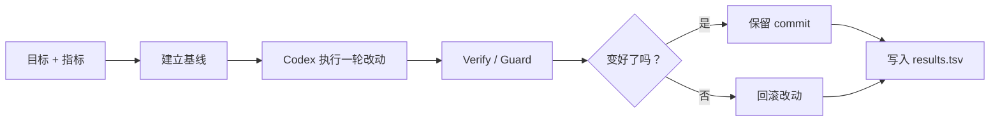

# Codex Autoresearch

[English](../README.md) | 简体中文

Codex Autoresearch 是一个面向 OpenAI Codex 的自动研究循环工具。它把 Karpathy loop 做成了真正可执行的 runner。

## 一眼看懂

- 一键启动：`autore start`
- 不是 prompt 集合，而是真正的 CLI runner
- 支持 `watch`、`resume`、bounded loop
- 支持中英文文档
- 自带一个可复制的最小 demo

## 复制这一条

第一次接触，直接跑：

```bash
autore start --demo --run
```

在自己的项目里直接跑：

```bash
autore start
```

`autore start` 会先自动补齐明显缺项。

完全不想思考参数：

```bash
autore quickstart
```

## 流程图



## 一键启动

```bash
autore start
```

如果仓库里还没有 `autoresearch.toml`，`autore start` 会自动识别 preset、生成配置、执行 `autore doctor --fix`，然后直接开始跑第一轮。

## 最常用命令

```bash
autore start
autore start --demo --run
autore quickstart
autore doctor
autore run --iterations 5
autore start --resume
autore status
autore watch --follow
```

## 最快验证

```bash
autore start --demo --run
```

## 最省心的入口

```bash
autore quickstart
```

如果你想先自动修掉明显缺项：

```bash
autore doctor --fix
```

## 最小可运行 demo

如果你想先看一个几乎零依赖、可直接复现成功的例子，看这里：

- [examples/demo-repo](../examples/demo-repo/README.md)

## 长任务观察

```bash
autore watch --follow
autore watch --stream stdout --follow
autore watch --stream results
```

## 夜间运行

- [Nightly 说明](nightly.md)
- [GitHub Actions 模板](../examples/nightly.yml)

## 常见问题

- [FAQ](faq.md)

## 相关文档

- [架构说明](architecture.md)
- [研究笔记](research-notes.md)
- [示例配置](../examples/autoresearch.toml)
- [最小 demo](../examples/demo-repo/README.md)
- [更新日志](../CHANGELOG.md)
