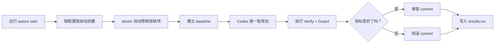

# Codex Autoresearch

[English](../README.md) | 简体中文

Codex Autoresearch 是把 Karpathy autoresearch loop 真正落地成 Codex 可执行工作流的最省心方案。

它不是一堆 prompt，而是一个真的会跑的外层循环：

- 一个目标
- 一个可量化指标
- 一次只做一轮 Codex 改动
- 每轮改完都执行 verify
- 自动决定保留还是回滚，并把结果记下来

## 从这里开始

如果你想 1 分钟内看到效果：

```bash
autore start --demo --run
```

如果你想直接用在自己的仓库：

```bash
autore start
```

如果你更想点按钮而不是记命令：

```bash
autore ui --open-browser
```

如果你想让工具先把仓库整理好，再告诉你下一步复制什么：

```bash
autore onboard --write-nightly
```

## `autore start` 到底会做什么？

`autore start` 是默认的傻瓜入口。

它会自动：

1. 判断你的仓库更像 Python、Node 还是 generic
2. 如果没有 `autoresearch.toml` 就自动创建
3. 执行 `autore doctor --fix`
4. 建立 baseline
5. 开始有边界的 Codex 循环
6. 指标变好就保留，没变好就回滚

长任务日志会写到 `.autoresearch/runs/iteration-XXXX/`。

## 这个项目解决什么问题？

当你希望 Codex 不是“随便改改”，而是围绕一个机械指标持续试错，这个项目就是干这个的。

常见场景：

- 提高 pytest 覆盖率
- 降低 bundle size
- 增加 collected tests
- 优化某个构建产物指标
- 让 Codex 围绕同一个数字持续做小改动

## 大多数人真正会用到的命令

### 1. 最快验证

```bash
autore start --demo --run
```

### 2. 在真实仓库里第一次开跑

```bash
autore start
```

### 3. 先整理仓库，再拿到下一步清单

```bash
autore onboard
```

### 4. 打开本地 UI

```bash
autore ui --open-browser
```

### 5. 生成夜跑 GitHub Actions

```bash
autore nightly --force
```

### 6. 观察长任务

```bash
autore watch --follow
autore watch --stream stdout --follow
autore watch --stream results
```

### 7. 继续上一次进度

```bash
autore start --resume
autore run --resume --iterations 5
```

## 第一次使用的典型流程



## 更省心的新入口：`autore onboard`

如果你不想研究配置细节，直接用：

```bash
autore onboard --write-nightly
```

它会：

- 运行带自动修复的 doctor
- 确保 `.autoresearch/` 被加入忽略列表
- 推断更合适的 preset
- 告诉你这个仓库最适合的使用场景
- 直接打印下一步可复制命令
- 可选生成 `.github/workflows/autoresearch-nightly.yml`

## 可视化 UI

如果你不想总在终端里切命令，直接运行：

```bash
autore ui --open-browser
```

这个本地 UI 提供：

- 仓库健康状态面板
- 一键修 setup 缺项
- 一键 onboarding 和 nightly workflow 生成
- 带终端输出的实时任务队列
- 不用手翻 TSV 也能看最近结果

## 示例配置

### Python 仓库

```toml
[research]
goal = "Increase test coverage from 72 to 90"
metric = "coverage percent"
direction = "higher"
verify = "pytest --cov=src 2>&1 | grep TOTAL"
scope = ["src/**", "tests/**"]
guard = "pytest"
iterations = 10
```

### Node 仓库

```toml
[research]
goal = "Reduce bundle size below 200 KB without breaking tests"
metric = "bundle size kb"
direction = "lower"
verify = "npm run build 2>&1 | grep 'First Load JS'"
scope = ["src/**"]
guard = "npm test"
iterations = 10
```

## 不手写 YAML 也能做夜跑

生成 workflow：

```bash
autore nightly --force
```

或者直接让 onboarding 帮你生成：

```bash
autore onboard --write-nightly
```

生成出来的 GitHub Actions 会：

- 每天 `01:00 UTC` 跑一次
- 先执行 `autore doctor --fix`
- 再执行有边界的 resume loop
- 把 `.autoresearch/results.tsv` 和运行日志上传成 artifact

看这里：

- [Nightly 说明](nightly.md)
- [GitHub Actions 模板](../examples/nightly.yml)

## 你最终会得到什么

- `autoresearch.toml`：仓库专属配置
- `.autoresearch/results.tsv`：每轮结果账本
- `.autoresearch/runs/...`：每轮 Codex 的 stdout/stderr 日志
- 基于指标的自动保留/回滚
- 可选 guard 命令用于防回归

## 为什么它比很多 autoresearch 项目更省心

很多 autoresearch 项目停留在 prompt 层。

这个项目给你的是 Codex 真正可执行的外循环：

- `autore start` 负责最短 happy path
- `autore onboard` 负责新仓库上手
- `autore nightly` 负责定时运行
- `autore watch` 负责长任务可观测性
- `autore run --resume` 负责继续已有进度

## 你可能会继续看的文件

- [CLI 入口](../src/codex_autoresearch/cli.py)
- [Runner](../src/codex_autoresearch/runner.py)
- [Nightly 文档](nightly.md)
- [架构说明](architecture.md)
- [FAQ](faq.md)
- [最小 demo](../examples/demo-repo/README.md)
- [GitHub Actions 模板](../examples/nightly.yml)
- [更新日志](../CHANGELOG.md)

## 灵感来源

- [karpathy/autoresearch](https://github.com/karpathy/autoresearch)
- [uditgoenka/autoresearch](https://github.com/uditgoenka/autoresearch)
- [openai/codex](https://github.com/openai/codex)
