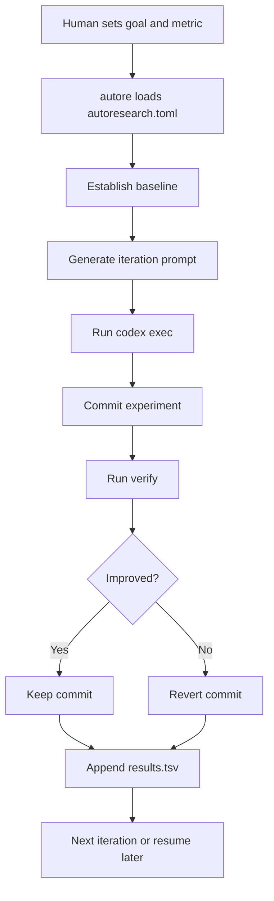

# Architecture

Codex Autoresearch turns the Karpathy loop into a Codex-native runner:

1. Establish a clean git baseline.
2. Capture a mechanical metric with a verify command.
3. Generate a fresh iteration prompt for Codex.
4. Run `codex exec` for one atomic change.
5. Commit the experiment.
6. Verify the metric and optional guard.
7. Keep improvements, revert non-improvements.
8. Append the outcome to `.autoresearch/results.tsv`.

## Design choices

- Codex-first: the system uses `codex exec` as the researcher, not as a hidden implementation detail.
- Git-backed memory: every experiment is committed so failures stay inspectable.
- Mechanical truth: verify commands decide success, not the agent's self-evaluation.
- Portable: the first release uses only the Python standard library.

## Near-term roadmap

- Unbounded mode with stop files
- Smarter metric extraction via regex and named groups
- Prompt templates for fix, debug, security, and learn modes
- Branch summaries and HTML reports
